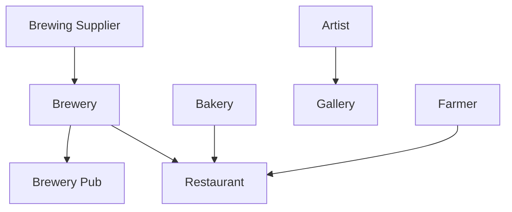

## Fedimints as a local business-to-business medium of exchange

#### 1. Introduction
Fedimints are a relatively new technology that use Federated Chaumian eCash as a medium of exchange within the federated mint (fedimint). Each fedimint is its own ecosystem, however the Fedimint implementation does allow for sending funds between fedimints using the Lightning network.

Let's take a step back to a higher level to see how fedimints align with the needs of a local community's business-to-business relationships. 

##### Governance 
We need to understand how fedimints are structurally governed. Fedimints operate with Bitcoin as their reserve asset. A 'member' of the fedimint deposits bitcoin and in return received the equivalent amount of eCash. With this eCash the member can transact with other members on the fedimint. It is a circular economy. Members can withdrawl their bitcoin by turning in their eCash. In this way it functions similar to a traditional bank and this is where the structure of the 'guardians' is critical to the success and longevity of every fedimint. 'Guardians' control the bitcoin held in reserve. Each one holds a key to a multisig wallet containing the bitcoin reserves of the fedimint. The specifics of the multisig can be configured when the fedimint is established. The Fedimint implementation has standards for the minimum number of signatures on the multisig to encourage responsible governance, but this is just a first step. This is where local community business-to-business is a great fit. We will dive deeper shortly after we cover privacy next.
   
##### Privacy 
Chaumian eCash behaves just like paper cash in your physical wallet, but over a digital medium. It is private. Your bank cannot see how you spend paper cash once you withdrawl it from an ATM. Simiarily, guardians in the fedimint do not know who is sending or receiving eCash, only the amounts being sent. This differs from Bitcoin. Transactions on the Bitcoin network are public and if your address is known to belong to you, everyone can see how you are transacting with bitcoin. For some, such as the Bitwise Bitcoin ETF this makes it easy for them to attest their holdings. For individuals this is a risk, potentially to physical security in case of a $5 wrench attack. This also makes it impossible for hostile governments to monitor your eCash transactions.

In summary, fedimint give us better privacy than native bitcoin in exchange for loss of control over our bitcoin. Essentially the fedimint is the custodian of our bitcoin and this requires our trust that the guardians will act responsibly and not issue more eCash than the amount of bitcoin they hold in reserve. In traditional banking, a small portion of our deposited money is held at the bank. This is known as fractional reserve banking. This is why bank runs are so detrimental to the banking system. The governance structure of the fedimint must align guardian incentives with the members to minimize the risk of fractional reserves.

#### 2. Local community business-to-business use case: Black Mountain, NC

##### Vibrant local economy
In the book One Second After, William Forstchen describes Black Mountain, NC in the following quote, *"John paused and looked back down the street for a moment. I’m living in a damn Norman Rockwell painting, he thought yet again, for the thousandth time."*. William Forstchen lives in Black Mountain and describes it well. Everyone knows everyone, yet it is a town of about 10,000 residents. The town is situated off Interstate 40 about 15 miles east of Asheville. Local businesses dominate the area including: hardware store, art galleries, pubs, breweries, music venues, bakeries, and restaurants. It is a healthy and thriving community with an influx of cash from tourists.

An important characteristic of Black Mountain businesses is the large amount of business-to-business transactions. Restaurants buy local baked goods; breweries, music venues and pubs buy beer from other local breweries; stores sell art and other wares from local artists and craftsmen. With the exception of the traditional payment rails, this is a circular economy. 

These traditional payment rails extract value and monitor a vibrant circular economy. This is where a fedimint can be leveraged to remove unjust surveillance and remove friction from the financial life blood of a thriving local economy.

##### Aligning incentives
A discussed, fedimint are not without risk. We determined the governance structure of a fedimint must align guardian incentives with the members to minimize the risk. Take for example a credit union. Board members in a credit union are elected by the members of the credit union. A similar approach can be used in a fedimint that provides specific services to a community. In the business-to-business example the guardian can be elected by the members. If our members are all business owners, the most trusted business owners in the community will be elected as guardians. These guardians rely on business from the members in the fedimint. It would be detrimental for them to undermine the well being of the fedimint. The incentives are aligned.

